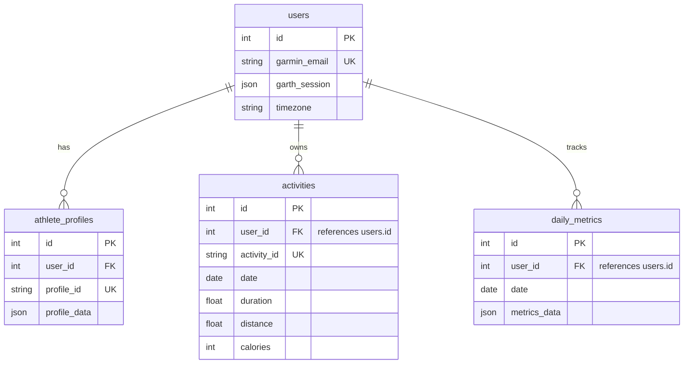
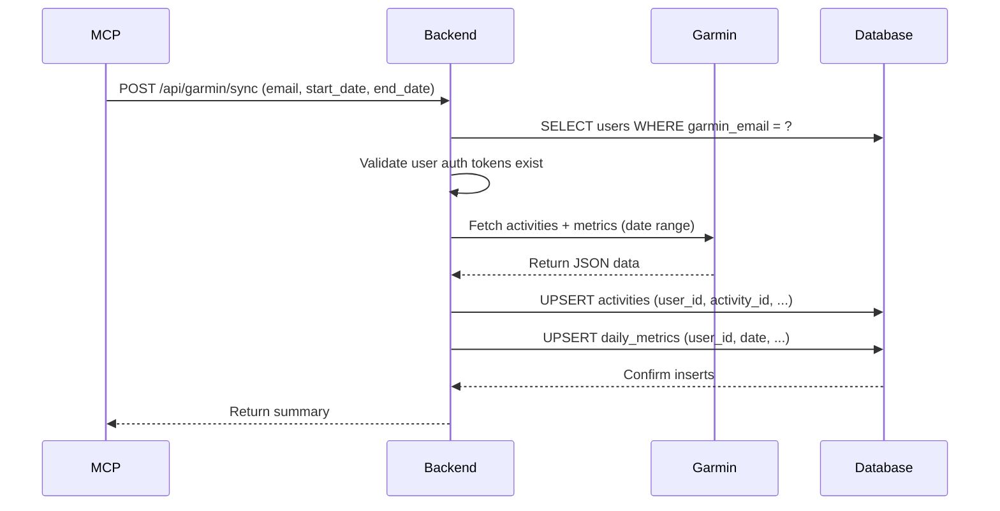

# Coach Backend - System Architecture

## Overview

The Coach Backend is a Node.js/Express API that integrates with Garmin Connect to provide AI-powered training coaching. This document defines the **single-source-of-truth** architectural patterns used throughout the system.

---

## Core Principles

### 1. Zero Error Tolerance

- **Foreign keys are enforced** - SQLite `PRAGMA foreign_keys = ON` is enabled globally
- **Referential integrity is validated** - Integrity checks run on startup and are exposed via health endpoint
- **Clear error messages** - No generic database errors or stack traces returned to clients
- **Fail-fast on corruption** - Server refuses to start if integrity checks fail

### 2. Single Source of Truth

- **One deployment method**: Docker Compose only (no local npm processes in production)
- **One database**: `./data/coach.db` (Docker volume mount, never local copies)
- **One user identifier**: `users.garmin_email` for API calls, `users.id` for internal foreign keys
- **One package manager strategy**: `npm ci` for production (reproducible builds)

### 3. Data Persistence

- All data stored in Docker volumes mounted from host filesystem
- Database and logs survive container restarts/removals
- No data stored inside containers (ephemeral)

---

## Database Schema

### Table Relationships



### Critical Foreign Key Rules

**IMPORTANT**: Only two tables reference `users.id` directly:

1. **activities.user_id** → `users.id` (NOT athlete_profiles.id)
2. **daily_metrics.user_id** → `users.id` (NOT athlete_profiles.id)

All other tables (diary_entries, planned_activities, llm_decisions, etc.) reference `athlete_profiles.id` as `profile_id`.

**Why this design?**
- Activities and metrics are synced from Garmin API per-user (one auth = one Garmin account)
- Athlete profiles can have multiple configurations per user (e.g., "runner" profile, "cyclist" profile)
- Diary entries and planned workouts are profile-specific, not user-specific

### Column Naming Convention

| Column Name | References | Used In Tables |
|-------------|------------|----------------|
| `user_id` | `users.id` | activities, daily_metrics, athlete_profiles |
| `profile_id` | `athlete_profiles.id` | diary_entries, planned_activities, llm_decisions, workout_history, weekly_summaries |

**Migration Note**: The migration `20260403_fix_profile_id_foreign_keys.js` renamed columns in activities and daily_metrics from `profile_id` → `user_id` to clarify this distinction.

---

## User Identification

### External API Calls (MCP, Frontend)

**Primary Identifier**: `users.garmin_email` (string)

All MCP tools and API endpoints accept `email` parameter:

```javascript
// MCP tool call
get_activities({ email: "user@example.com" })

// API endpoint
GET /api/activity/recent?email=user@example.com
```

**Rationale**: Users authenticate with their Garmin email, making it the natural identifier.

### Internal Database Queries

**Primary Key**: `users.id` (integer)

All joins and foreign keys use numeric IDs for performance:

```javascript
// Query activities for user
const user = await db('users').where('garmin_email', email).first();
const activities = await db('activities').where({ user_id: user.id });
```

**Rationale**: Integer foreign keys are faster than string comparisons for large datasets.

---

## Sync Data Flow

### Garmin Authentication

1. User provides email + password (+ MFA if required)
2. Backend authenticates with Garmin Connect API
3. Garmin session tokens stored encrypted in `users.garth_session` (JSON)
4. Session tokens reused for subsequent syncs

### Data Sync Process



### Activity Storage

Each activity is stored with:
- `user_id`: References `users.id` (who owns this activity)
- `activity_id`: Garmin's unique activity ID (used for deduplication)
- `date`: Activity start date (indexed for queries)
- `raw_activity_data`: Full JSON from Garmin API (for debugging/future fields)

**Schema Mapping**: The `activity-schema-mapper.js` utility maps app database fields to legacy GarminDB schema for backward compatibility with existing analytics code.

---

## Query Patterns

### Correct Pattern (✅)

All queries for activities and daily_metrics use `user_id`:

```javascript
// Get user first
const user = await db('users').where('garmin_email', email).first();
if (!user) {
  throw new Error(`No Garmin authentication found for ${email}`);
}

// Query with user.id
const activities = await db('activities')
  .where({ user_id: user.id })
  .where('date', '>=', startDate)
  .orderBy('date', 'desc');
```

### Wrong Pattern (❌)

Do NOT query athlete_profiles.id for activities:

```javascript
// WRONG - activities don't reference athlete_profiles.id
const profile = await db('athlete_profiles').where({ ... }).first();
const activities = await db('activities')
  .where({ user_id: profile.id }); // BUG: this will return 0 results
```

### Pre-Sync Validation

Before syncing, validate:

1. User exists: `const user = await db('users').where('garmin_email', email).first();`
2. Auth tokens exist: `if (!user.garth_session) throw new Error(...);`
3. Date range valid: `if (startDate > endDate) throw new Error(...);`

**No Stack Traces**: Return clear error messages to clients, never raw exceptions.

---

##Deployment

### The ONLY Deployment Method

**Docker Compose** is the single supported production deployment:

```bash
# Start services
docker compose up -d

# Stop services
docker compose down

# Rebuild after code changes
docker compose build coach
docker compose up -d --force-recreate
```

**Why Docker only?**

1. **Consistent environment** - Same Node version, OS packages, Python dependencies
2. **Volume persistence** - Data survives container restarts
3. **Health checks** - Automatic monitoring and restart on failure
4. **Port isolation** - Backend and MCP on separate ports
5. **No process confusion** - No wondering "which node process is running?"

### Local Development vs Production

| Environment | Method | Port | Database Path |
|-------------|--------|------|---------------|
| **Production** | `docker compose up -d` | 8088 | `/app/data/coach.db` (volume mount from `./data/`) |
| **Development** | `npm run dev` (in backend/) | 8080 (different!) | `backend/data/coach.db` (local copy for testing) |

**CRITICAL**: Never run both simultaneously - they will conflict on database locks.

---

## Data Persistence

### Volume Mounts

Configured in `docker-compose.yml`:

```yaml
services:
  coach:
    volumes:
      - ./data:/app/data        # Database + Garmin data
      - ./logs:/app/logs        # Application logs
```

### Backup Strategy

**Before every migration**:

```bash
cp ./data/coach.db ./data/coach.db.backup-$(date +%Y%m%d-%H%M%S)
```

**Automated daily backups** (recommended):

```bash
# Add to crontab
0 3 * * * cp /path/to/coach/data/coach.db /backups/coach-$(date +\%Y\%m\%d).db
```

### Restore Procedure

```bash
# Stop containers
docker compose down

# Restore database
cp ./data/coach.db.backup-20260403-120000 ./data/coach.db

# Restart
docker compose up -d
```

---

## Package Management

### Production Builds

**Always use `npm ci`** in Dockerfile:

```dockerfile
COPY backend/package*.json ./backend/
RUN cd backend && npm ci --only=production && \
    npm rebuild sqlite3 --build-from-source
```

**Why npm ci?**
- **Reproducible**: Installs exact versions from package-lock.json
- **Secure**: Prevents supply chain attacks (verifies integrity)
- **Fast**: Deletes node_modules first, clean install
- **Fails on mismatch**: If package.json and lock file don't match, build fails (intentional!)

### Lock File Regeneration

Only regenerate when necessary (e.g., after package.json changes):

```bash
cd backend
rm -f package-lock.json
npm install
git add package-lock.json
git commit -m "chore: regenerate package-lock.json"
```

**Never commit** `node_modules/` - always in `.gitignore`.

---

## Health Monitoring

### Startup Integrity Checks

On server startup, before accepting requests:

1. Database connection test
2. Foreign keys enabled check (`PRAGMA foreign_keys`)
3. Orphaned records check (activities/metrics with invalid user_id)
4. Duplicate users check
5. NULL value checks in critical fields

**Fail-fast**: If any check fails, server exits with non-zero code.

### Health Endpoint

`GET /api/health` returns comprehensive status:

```json
{
  "status": "healthy",
  "timestamp": "2026-04-03T12:34:56.789Z",
  "database": {
    "connection": "ok",
    "foreign_keys_enabled": true,
    "integrity_checks": {
      "all_passed": true,
      "orphaned_activities": 0,
      "orphaned_daily_metrics": 0,
      "duplicate_users": 0
    },
    "statistics": {
      "user_count": 1,
      "activity_count": 131,
      "daily_metrics_count": 45,
      "last_sync": "2026-04-03T11:12:33Z"
    }
  }
}
```

**Status Codes**:
- `200 OK` - All checks passed
- `503 Service Unavailable` - Integrity checks failed (database corrupted)

---

## Error Handling

### API Error Responses

**Clear, actionable messages**:

```json
{
  "error": "No Garmin authentication found for user@example.com. Please run authenticate_garmin first.",
  "hint": "Call POST /api/garmin/login with email and password"
}
```

**NOT generic exceptions**:

```json
{
  "error": "Database query failed",
  "stack": "Error: SQLITE_CONSTRAINT..."  // ❌ Never expose stack traces
}
```

### Pre-Sync Validation Errors

Return HTTP 400 with clear message:

```javascript
if (!user.garth_session) {
  return res.status(400).json({
    error: 'No Garmin authentication found',
    message: `No Garmin authentication found for ${email}. Please run authenticate_garmin first.`,
    hint: 'Use the authenticate_garmin MCP tool to login'
  });
}
```

---

## Security

### Authentication Encryption

Garmin session tokens are encrypted before storage:

- Encryption key: `process.env.ENCRYPTION_KEY` (AES-256)
- Stored in: `users.garth_session` (JSON string)
- Decrypted on each sync request

**If encryption key is lost**, users must re-authenticate (sessions can't be decrypted).

### API Authentication

Backend API secured with bearer token:

```bash
# In .env
BACKEND_API_KEY=your-secret-key-here

# API calls
curl -H "Authorization: Bearer your-secret-key" http://localhost:8088/api/...
```

### MCP Authentication

MCP server uses separate bearer token:

```bash
# In .env
MCP_AUTH_TOKEN=your-mcp-token-here

# VS Code connects with this token
```

---

## Future Considerations

### Multi-User Support

Current architecture supports multiple users:
- Each user has unique `garmin_email` (enforced by unique constraint)
- Activities and metrics isolated by `user_id`
- Frontend/MCP can filter by email parameter

### Historical Data Migration

If needed to import activities from legacy GarminDB SQLite files:

1. Create script in `backend/scripts/import-garmindb-history.js`
2. Read activities from GarminDB
3. Map to app database schema using `activity-schema-mapper.js`
4. Insert with proper `user_id` (lookup from email)

**Recommended**: Only import if user specifically requests historical analysis.

---

## Summary

**Single Source of Truth Guarantees**:

✅ **One deployment method**: Docker Compose
✅ **One database**: ./data/coach.db (Docker volume)
✅ **One user identifier**: garmin_email (external), users.id (internal)
✅ **One foreign key pattern**: activities/daily_metrics → users.id
✅ **One package strategy**: npm ci with committed lock files
✅ **One health check**: /api/health with integrity validation

**Zero Error Tolerance**:

✅ Foreign keys enforced (PRAGMA foreign_keys = ON)
✅ Referential integrity validated on startup
✅ Clear error messages (no stack traces)
✅ Fail-fast on corruption (server refuses to start)
